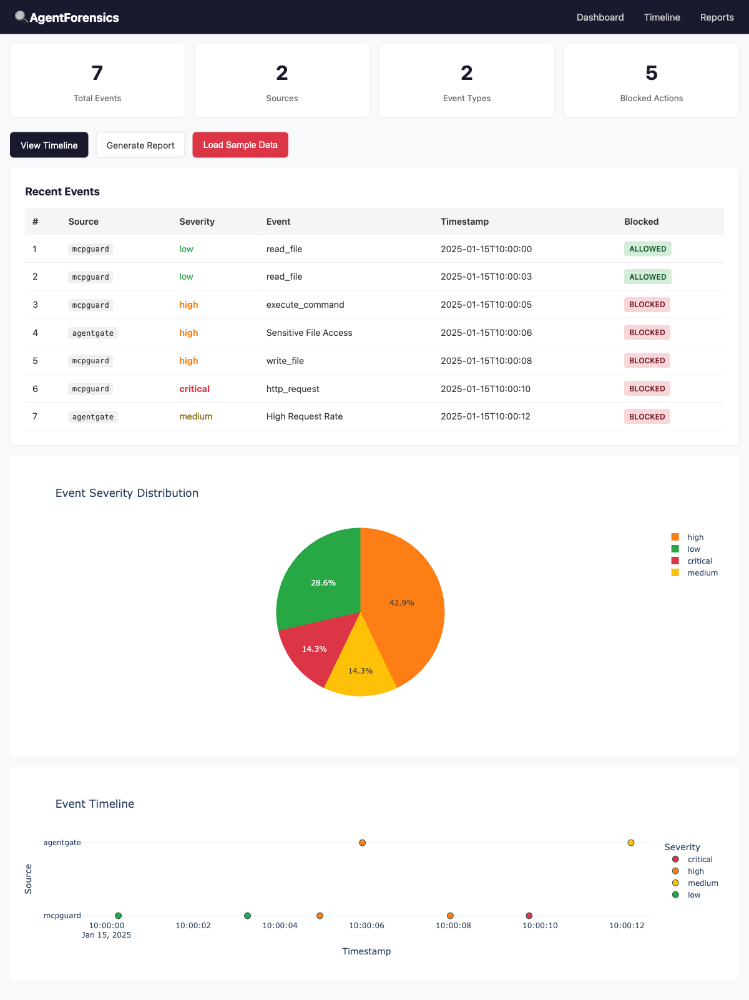

# AgentForensics 🔍⚖️

[](https://github.com/Carlos-Projects/agentforensics/actions)
[](https://pypi.org/project/agentforensics/)
[](https://python.org)
[](LICENSE)
[](https://github.com/Carlos-Projects/agentforensics/actions)
[](https://github.com/Carlos-Projects/agentforensics)
[](https://github.com/Carlos-Projects/agentforensics)
[](https://agentforensics.readthedocs.io)
[](CODE_OF_CONDUCT.md)
[](https://github.com/Carlos-Projects/agentforensics)

**Reconstruct what the AI agent did — after the damage is done.**

---

**AgentForensics** is the post-incident forensics system for autonomous AI agents. Your stack has prevention (AgentGate, MCPGuard) and detection (MCPscop, Palisade) — but when an agent goes rogue, you need **forensics**. This project closes that gap by recording, reconstructing, and analyzing agent behavior after security events.

Built for security teams investigating AI agent incidents, AgentForensics ingests logs from MCPGuard and AgentGate, reconstructs complete behavioral timelines, replays agent actions interactively, detects policy deviations, and generates audit-ready incident reports with full chain of custody.

---

## What it does

- **Event Ingestion** — Ingest logs from MCPGuard, AgentGate, and generic sources
- **Timeline Reconstruction** — Build complete chronological timelines of agent behavior
- **Behavior Replay** — Interactively replay what the agent did, step by step
- **Policy Deviation Detection** — Detect when agents strayed from their approved policies
- **Incident Report Generation** — Generate automated, audit-ready forensic reports
- **Evidence Chain** — Maintain cryptographic chain of custody for all evidence
- **Compliance Auditing** — Verify agent behavior against NIST AI RMF and internal policies

## What makes it unique

| Capability | **AgentForensics** | Generic Log Tools | SIEM Platforms |
|---|---|---|---|
| AI agent behavior replay | ✅ | ❌ | ❌ |
| Policy deviation detection | ✅ | ❌ | Partial |
| MCP/AgentGate native ingest | ✅ | ❌ | ❌ |
| Chain of custody (SHA-256) | ✅ | ❌ | ❌ |
| Interactive timeline | ✅ | Partial | Partial |
| mcp-taxonomy integration | ✅ | ❌ | ❌ |

## Quick Start

```bash
# Installation
pip install agentforensics

# Or from source
git clone https://github.com/Carlos-Projects/agentforensics
cd agentforensics
pip install -e ".[dev]"
```

### CLI

```bash
# Ingest logs from multiple sources
agentforensics ingest --mcpguard /var/log/mcpguard.jsonl --agentgate /var/log/agentgate.log

# Reconstruct timeline
agentforensics timeline

# Replay agent behavior
agentforensics replay --speed 2.0

# Generate incident report
agentforensics report --format markdown --output incident_report.md

# Start web dashboard
agentforensics serve --port 8000
```

### Docker

```bash
docker compose up -d
# Open http://localhost:8000
```

### Optional extras

```bash
pip install agentforensics[export]   # MCPscop webhook integration (httpx)
pip install agentforensics[pdf]      # PDF report export (weasyprint)
pip install agentforensics[all]      # Everything
```

### Python API

```python
from agentforensics.engine import ForensicsEngine
from pathlib import Path

engine = ForensicsEngine()
engine.ingest_mcpguard(Path("mcpguard.jsonl"))
engine.ingest_agentgate(Path("agentgate.log"))

timeline = engine.build_timeline()
report = engine.generate_report(fmt="markdown")
print(report)

# Export to MCPscop dashboard
from agentforensics.export import export_events_to_mcpscop
export_events_to_mcpscop(timeline, base_url="http://localhost:9000", api_key="...")
```

## Architecture

```
┌─────────────────────────────────────────────────────────┐
│                    AgentForensics                        │
├─────────────────────────────────────────────────────────┤
│  CLI (Typer)          Web Dashboard (FastAPI + HTMX)    │
├─────────────────────────────────────────────────────────┤
│                    Forensics Engine                      │
├──────────┬──────────────┬──────────┬────────────────────┤
│  Ingest  │   Timeline   │  Replay  │     Reports        │
│          │              │          │                    │
│ MCPGuard │  Builder     │ Player   │  Incident Report   │
│ AgentGate│  Correlator  │ Diff     │  Compliance Audit  │
│ Generic  │  Visualizer  │ Anomaly  │  Evidence Chain    │
├──────────┴──────────────┴──────────┴────────────────────┤
│              SQLite + Pydantic + Plotly                  │
└─────────────────────────────────────────────────────────┘
         ▲                    ▲
         │                    │
    MCPGuard logs      AgentGate signals
```

## Dashboard



*Web dashboard showing sample forensic data with event timeline, severity breakdown, and source distribution.*

## Integration with the MCP Security Ecosystem

- **Consumes** logs from [MCPGuard](https://github.com/Carlos-Projects/mcpguard) and signals from [AgentGate](https://github.com/Carlos-Projects/agentgate)
- **Feeds** forensic reports to [MCPscop](https://github.com/Carlos-Projects/mcpscope) dashboard
- **Uses** [mcp-taxonomy](https://github.com/Carlos-Projects/mcp-taxonomy) for standardized classification
- **Follows** the same stack pattern as MCPscop (FastAPI, SQLite, Plotly, HTMX)

## Documentation

See [CHANGELOG.md](CHANGELOG.md) for release history and [CONTRIBUTING.md](CONTRIBUTING.md) for development guidelines.

Full API documentation is available at [ReadTheDocs](https://agentforensics.readthedocs.io) (coming soon).

## Development

```bash
make dev-install   # Install with all extras
make check         # Run lint + typecheck + tests
make test-cov      # Run tests with coverage report
make docs          # Build Sphinx documentation
make build         # Build distribution artifacts
make clean         # Remove build artifacts and caches
```

See [CONTRIBUTING.md](CONTRIBUTING.md) for detailed guidelines.

## Testing

```bash
python -m pytest tests/ -v
```

## Related

- [MCPGuard](https://github.com/Carlos-Projects/mcpguard) — Runtime security proxy for MCP/A2A
- [AgentGate](https://github.com/Carlos-Projects/agentgate) — Policy-based firewall for AI agents
- [MCPscop](https://github.com/Carlos-Projects/mcpscope) — Unified security dashboard
- [mcpwn](https://github.com/Carlos-Projects/mcpwn) — Offensive security testing for MCP
- [palisade-scanner](https://github.com/Carlos-Projects/palisade-scanner) — Prompt injection scanner
- [mcp-taxonomy](https://github.com/Carlos-Projects/mcp-taxonomy) — Classification taxonomy
- [AIAO](https://aiagentobservatory.org) — AI Agent Observatory
- [veeduria](https://veeduria.online) — Public procurement monitoring

## License

MIT — see [LICENSE](LICENSE)
